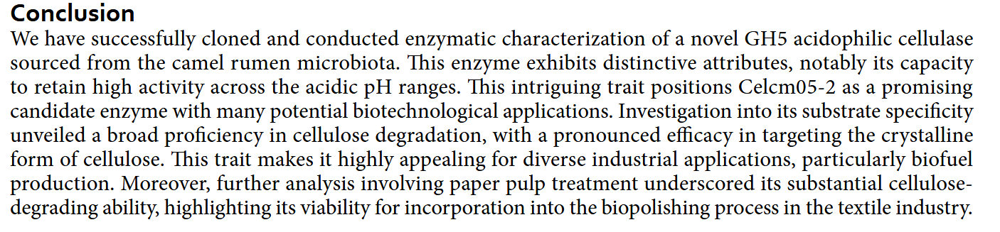
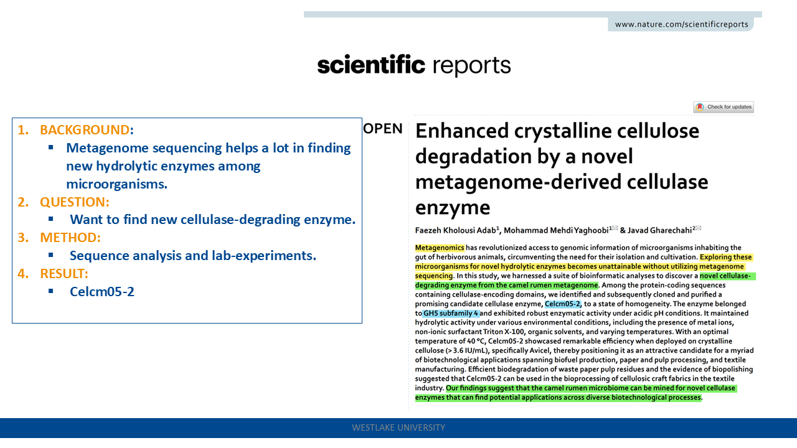
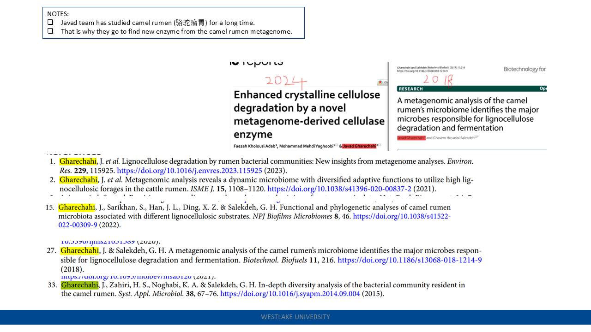
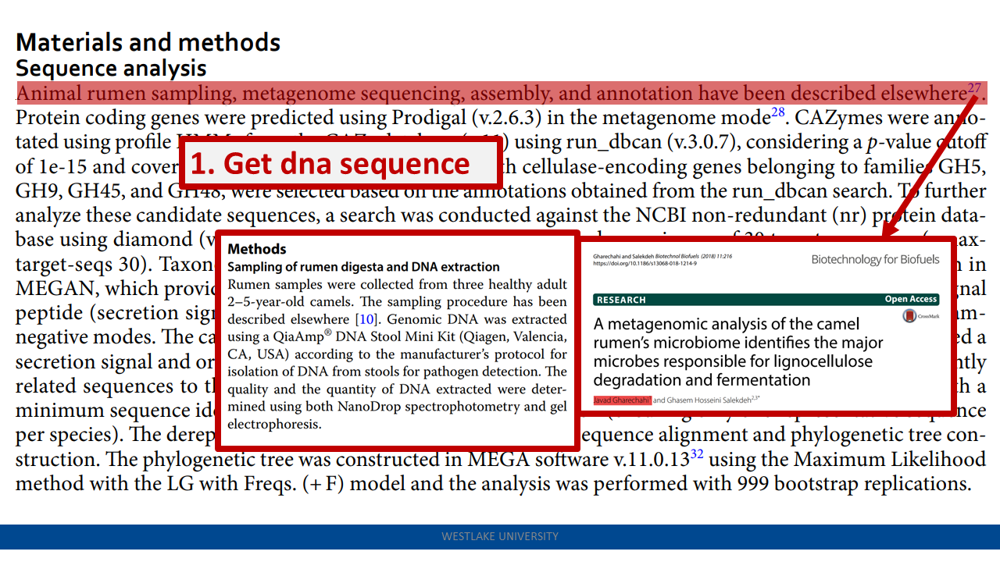
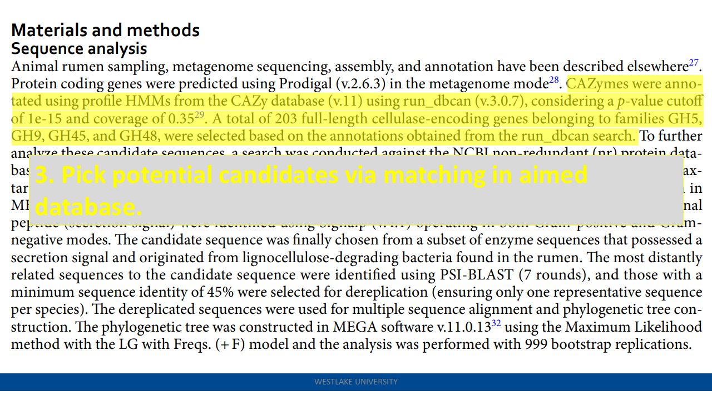
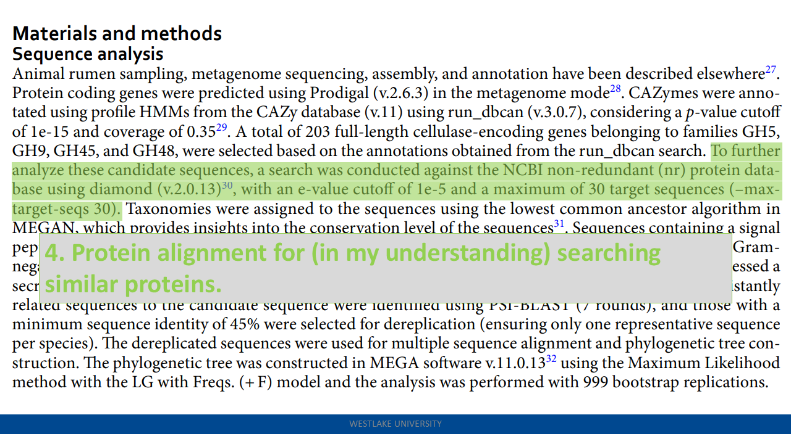
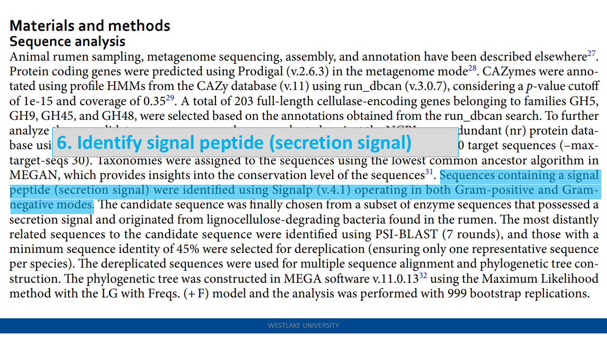
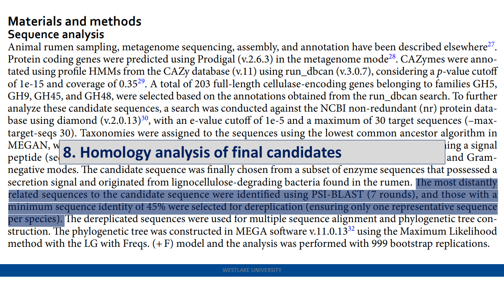
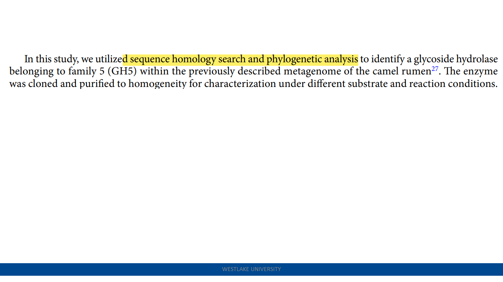

> Enhanced crystalline cellulose degradation by a novel metagenome-derived cellulase enzyme

Celcm05-2: The camel rumen metagenome-assembled sequences and the predicted protein-coding genes have been deposited to the Integrated Microbial Genomes (IMG) database under the IMG dataset ID: 3300003523. [link](https://img.jgi.doe.gov/cgi-bin/m/main.cgi?section=GenomeSearchList&page=displayTaxonList&searchFilter=t.taxon_oid&searchTerm=3300003523&file=t.taxon_oid482636)
- a broader pH range

    
slides

>  Cell-free chemoenzymatic starch synthesis from carbon dioxide

- Carbonic anhydrase
- Formate dehydrogenase
- Formyltetrahydrofolate synthetase
- Methenyltetrahydrofolate cyclohydrolase
- Methylenetetrahydrofolate dehydrogenase
- Methylenetetrahydrofolate reductase
- Glucose-1-phosphate adenylyltransferase
- ADP-glucose pyrophosphorylase
- Starch synthase
- Branching enzyme
- Debranching enzyme

