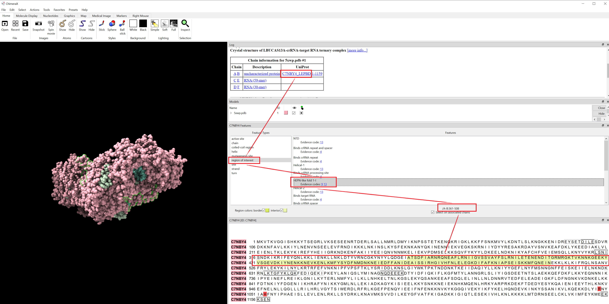
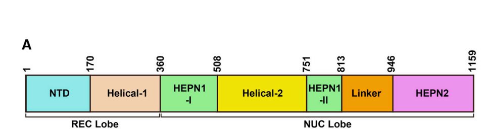

# domain definition
 If I have protein dataset (fasta and pdb files), and I can perform cluster analysis using similarity calculation, then, how to define or decide to say this set of (parts of) sequences is much worthy for us to do wet-lab experiments, in order to discover new domains.

  1. [discover uncharacterized proteins with targe domains](#discover-new-proteins-with-targe-domains)
  2. [discover uncharacterized proteins purely using cluster and alignment analysis](#discover-uncharacterized-proteins-purely-using-cluster-and-alignment-analysis)

 > SCOPe: Structural Classification of Proteins—extended, integrating SCOP and ASTRAL data and classification of new structures 

## 1. Discover uncharacterized proteins with targe domains
### Example
 > Structure-guided discovery of ancestral CRISPR-Cas13 ribonucleases
#### replication
##### tools:
- ColdFold ( https://github.com/sokrypton/ColabFold ) for structure prediction.
- DaliLite.v5 manual ( http://ekhidna2.biocenter.helsinki.fi/dali/README.v5.html ) for systematic search (kind of structure-based search).
- HMMsearch ( http://hmmer.org/documentation.html ) for sequence similarity search.
- CRISPR Recognition Tool (CRT) ( https://bmcbioinformatics.biomedcentral.com/articles/10.1186/1471-2105-8-209 ) http://www.room220.com/crt/


##### progress:
1. Cas13a, Cas13b, and Cas13d whose structures are PDBID: 5XWP, 6DTD, 6E9F
2. *For Cas13c, which lacks an experimental structure, a ColabFold (43) model of A0A9X2MGT7 was generated using three recycles without amber relaxation.* A0A9X2MGT7 fasta is [https://www.uniprot.org/uniprotkb/A0A9X2MGT7/entry](https://www.uniprot.org/uniprotkb/A0A9X2MGT7/entry)
<details>
  <summary><b>ColabFold Usage to generate A0A9X2MGT7 structure</b></summary>

  ```
  # https://github.com/sokrypton/ColabFold
  colabfold_batch A0A9X2MGT7.fasta out_dir --num-recycle 3

  # To activate this environment, use
  #
  #     $ conda activate /storage/shenhuaizhongLab/lihuilin/ColabFold/localcolabfold/colabfold-conda
  #
  # To deactivate an active environment, use
  #
  #     $ conda deactivate
  Installation of ColabFold finished.
  Add /storage/shenhuaizhongLab/lihuilin/ColabFold/localcolabfold/colabfold-conda/bin to your PATH environment variable to run 'colabfold_batch'.
  i.e. for Bash:
          export PATH="/storage/shenhuaizhongLab/lihuilin/ColabFold/localcolabfold/colabfold-conda/bin:$PATH"
  For more details, please run 'colabfold_batch --help'.


  (/storage/shenhuaizhongLab/lihuilin/ColabFold/localcolabfold/colabfold-conda) [lihuilin@gvnq04 localcolabfold]$ colabfold_batch A0A9X2MGT7.fasta out_dir --num-recycle 3
  2024-08-07 11:04:22,702 Running colabfold 1.5.5 (1ccca5a53d20c909f3ccf8a4b81df804e6717cb1)

  WARNING: You are welcome to use the default MSA server, however keep in mind that it's a
  limited shared resource only capable of processing a few thousand MSAs per day. Please
  submit jobs only from a single IP address. We reserve the right to limit access to the
  server case-by-case when usage exceeds fair use. If you require more MSAs: You can
  precompute all MSAs with `colabfold_search` or host your own API and pass it to `--host-url`

  2024-08-07 11:04:23,783 Running on GPU
  2024-08-07 11:04:24,437 Found 5 citations for tools or databases
  2024-08-07 11:04:24,437 Query 1/1: tr_A0A9X2MGT7_A0A9X2MGT7_9FIRM_Type_VI-C_CRISPR-associated_RNA-guided_ribonuclease_Cas13c_OS_Anaerosalibacter_massiliensis_OX_1347392_GN_cas13c_PE_4_SV_1 (length 1111)
  COMPLETE: 100%|███████████████████████████████████████████████████████████████████████████████████████████████████████████████████████████████████████████████████████████████████████████████████████████████████████████████████████████████████████████████████████████████████| 150/150 [elapsed: 00:01 remaining: 00:00]
  2024-08-07 11:04:27,519 Setting max_seq=64, max_extra_seq=1
  2024-08-07 11:05:56,561 alphafold2_ptm_model_1_seed_000 recycle=0 pLDDT=55.2 pTM=0.45
  2024-08-07 11:06:50,394 alphafold2_ptm_model_1_seed_000 recycle=1 pLDDT=68.6 pTM=0.646 tol=11.5
  2024-08-07 11:07:44,227 alphafold2_ptm_model_1_seed_000 recycle=2 pLDDT=73.1 pTM=0.686 tol=2.22
  2024-08-07 11:08:38,082 alphafold2_ptm_model_1_seed_000 recycle=3 pLDDT=73 pTM=0.685 tol=0.964
  2024-08-07 11:08:38,083 alphafold2_ptm_model_1_seed_000 took 231.7s (3 recycles)
  2024-08-07 11:09:32,989 alphafold2_ptm_model_2_seed_000 recycle=0 pLDDT=61.8 pTM=0.491
  2024-08-07 11:10:26,871 alphafold2_ptm_model_2_seed_000 recycle=1 pLDDT=71.2 pTM=0.655 tol=7.3
  2024-08-07 11:11:20,753 alphafold2_ptm_model_2_seed_000 recycle=2 pLDDT=73.8 pTM=0.698 tol=2.15
  2024-08-07 11:12:14,653 alphafold2_ptm_model_2_seed_000 recycle=3 pLDDT=73.9 pTM=0.695 tol=0.867
  2024-08-07 11:12:14,655 alphafold2_ptm_model_2_seed_000 took 215.5s (3 recycles)
  2024-08-07 11:13:09,562 alphafold2_ptm_model_3_seed_000 recycle=0 pLDDT=64.3 pTM=0.554
  2024-08-07 11:14:03,448 alphafold2_ptm_model_3_seed_000 recycle=1 pLDDT=72.8 pTM=0.688 tol=7.73
  2024-08-07 11:14:57,322 alphafold2_ptm_model_3_seed_000 recycle=2 pLDDT=75.1 pTM=0.712 tol=1.73
  2024-08-07 11:15:51,181 alphafold2_ptm_model_3_seed_000 recycle=3 pLDDT=76.1 pTM=0.716 tol=0.902
  2024-08-07 11:15:51,182 alphafold2_ptm_model_3_seed_000 took 215.5s (3 recycles)
  2024-08-07 11:16:46,085 alphafold2_ptm_model_4_seed_000 recycle=0 pLDDT=62.3 pTM=0.528
  2024-08-07 11:17:39,954 alphafold2_ptm_model_4_seed_000 recycle=1 pLDDT=73.9 pTM=0.709 tol=6.2
  2024-08-07 11:18:33,819 alphafold2_ptm_model_4_seed_000 recycle=2 pLDDT=75.2 pTM=0.718 tol=1.76
  2024-08-07 11:19:27,693 alphafold2_ptm_model_4_seed_000 recycle=3 pLDDT=75.3 pTM=0.708 tol=1.54
  2024-08-07 11:19:27,695 alphafold2_ptm_model_4_seed_000 took 215.5s (3 recycles)
  2024-08-07 11:20:22,592 alphafold2_ptm_model_5_seed_000 recycle=0 pLDDT=64.3 pTM=0.591
  2024-08-07 11:21:16,475 alphafold2_ptm_model_5_seed_000 recycle=1 pLDDT=73.8 pTM=0.716 tol=6.65
  2024-08-07 11:22:10,378 alphafold2_ptm_model_5_seed_000 recycle=2 pLDDT=74.9 pTM=0.731 tol=1.27
  2024-08-07 11:23:04,285 alphafold2_ptm_model_5_seed_000 recycle=3 pLDDT=75.8 pTM=0.738 tol=1.16
  2024-08-07 11:23:04,287 alphafold2_ptm_model_5_seed_000 took 215.6s (3 recycles)
  2024-08-07 11:23:05,290 reranking models by 'plddt' metric
  2024-08-07 11:23:05,309 rank_001_alphafold2_ptm_model_3_seed_000 pLDDT=76.1 pTM=0.716
  2024-08-07 11:23:05,310 rank_002_alphafold2_ptm_model_5_seed_000 pLDDT=75.8 pTM=0.738
  2024-08-07 11:23:05,311 rank_003_alphafold2_ptm_model_4_seed_000 pLDDT=75.3 pTM=0.708
  2024-08-07 11:23:05,312 rank_004_alphafold2_ptm_model_2_seed_000 pLDDT=73.9 pTM=0.695
  2024-08-07 11:23:05,313 rank_005_alphafold2_ptm_model_1_seed_000 pLDDT=73 pTM=0.685
  2024-08-07 11:23:08,499 Done
   ```
</details>

3. isolate HEPN core regions using ChimeraX: \
  (1) 5XWP: Cas13a, HEPN domain sequences (3 fragments) extraction using ChimeraX \

```
# cas13a-5xwp-HEPN-like-fold-1-I = 5xD1.pdb = sequence_ids = list(range(361,509))
# cas13a-5xwp-HEPN-like-fold-1-II = 5xD2.pdb = sequence_ids = list(range(752,814))
# cas13a-5xwp-HEPN-like-fold-2 = 5xD3.pdb = sequence_ids = list(range(947,1153))
```
  (2) 6DTD: \
  (3) 6E9F: \
  (4) A0A9X2MGT7: 


4. All pdb to internal data format (xxxxX.dat) used by Dali/import.pl
<div class="warning">
After <code>$ tar -zxvf DaliLite.v5.tar.gz</code>, <code>$ cd DaliLite.v5/bin</code>, <code>$ make clean</code>, <code>$ make</code>, replace <code>$ DaliLite.v5/bin/dsspcmbi</code> with <code>$ aliLite.v5/bin/dsspcmbi/dsspcmbi</code>
</div>

5. systematic search by Dali/dali.pl


############################################## stop here #############################################################


```
module load blast/2.11.0+
cd domainPDB

../bin/import.pl 
--pdbfile ../toy_PDB/pdb1ppt.ent 
--pdbid 1ppt 
--dat ./ 
> import.stdout 2> import.stderr

```

```
../bin/dali.pl 
--cd1 2nrmA  # --cd1 <xxxxX>             query structure identifier
--db pdb.list #--db <filename>           list of target structure identifiers
--TITLE systematic 
--dat1 ../DAT # path to directory containing query data [default: ./DAT/]
--dat2 ../DAT # path to directory containing target data [default: ./DAT/]
> systematic.stdout 
2> systematic.stderr

```


4. http://ekhidna2.biocenter.helsinki.fi/dali/README.v5.html


###############################################################

1. automated structureal-search pipeline
    * identify an ancestral clade of Cas13 (Cas13an).
    * trace Cas13 origins to defense-associated ribonucleases.
2. Cas13an is 1/3 size of other Cas13s
3. Cas13an mediates: 1) robust programmable RNA depletion and 2) defense against diverse bacteriophages
4. **pipeline:** 
    1) leveraged a Fold seek-clustered AlphaFold database (20), whose reduced search space makes slow-but-sensitive DALI searches feasible. **Preprocessed AlphaFold Database for use with DaliLite running locally**: [link](http://ekhidna2.biocenter.helsinki.fi/dali/digest.html)
    2) Using representative HEPN dimers within known Cas13 proteins (21–23) as the search query, we found twelve previously uncharacterized protein clusters in the AlphaFold database bearing an intramolecular HEPN dimer (fig. S1 and tables S1 and S2).
    3) Further sequence-based homology searches and genomic analyses revealed that two of the newly identified clusters occur next to CRISPR arrays, representing a new Cas13 subtype (Cas13an) (Fig. 1A and fig. S2)
    4) Notably, neither Foldseek nor hidden Markov model searches were able to detect significant homology between previously known Cas13s and Cas13an (fig. S3). 
    5) This highlights the considerable divergence of Cas13an compared to known Cas13 proteins, and underscores the importance of sensitive search strategies.
### Structural-search and novel CRISPR system identification pipeline
1. By manually examining the structures of previously characterized Cas13 subtypes, researchers curated the conserved intramolecular HEPN dimer core. (**as the conserved domain**)
2. get 4 examples (Cas13a, Cas13b, and Cas13d, and Cas13c)
3. The HEPN core regions were isolated from the Cas13 protein structures using ChimeraX (44).
4. The HEPN core regions are used as queries in DALI. 
> To search against the entirety of the AlphaFold database (~200 million structures) (14), DALI’s slow performance presented a major bottleneck. To circumvent this, the search was performed against the **~2.3 million cluster representatives** generated by clustering the AlphaFold database with Foldseek 
5. **~2.3 million cluster representatives** were subdivided into batches that each contained 1000 structures, resulting in a total of 2304 batches.
6. After completing DALI-searches against the AlphaFold database, only hits with the signature Rx4H motif of HEPN domains and a DALI Z-score greater than 6 were retained.
7. Finally, only hits that also bear an intramolecular HEPN dimer were considered as Cas13 candidates.
8. Sequences of Cas13 candidates were retrieved and used as input for PSI-BLAST (45) and HMMsearch (46) against the NCBI NR database (47) using default settings.
9. contigs encoding the Cas13 candidates were downloaded, and annotated for CRISPR arrays using the CRT tool (v1.2) (48). This analysis led to the identification of the Cas13an systems characterized in this study.
10. 


1. 5XWP:



## 2. discover uncharacterized proteins purely using cluster and alignment analysis
> Holm, Liisa, et al. "DALI shines a light on remote homologs: One hundred discoveries." Protein Science 32.1 (2023): e4519.

1. Pfam 35.0, which contains a total of 19,632 families. Among these, 7770 families are grouped into 655 clans, corresponding to superfamilies in other classifications (Mistry et al., 2020).
2. Many Pfam families represent domains, covering only part of a protein.
3. For each Pfam family, we selected a representative member of median length for that family. 

1. Pfam 35.0 has 19,632 families.
    - select 59% who are in AlphaFold Database version 1
        - cut-off pLDDT<70, resulting in cropped models
        - (BECAUSE: at not all AlphaFold models are compact and globular)\
          *-* filter0: remove many ill-folded models from the analysis as confirmed by visual inspection.\
          *-* filter2: the contact order (CO) had to meet the range of native proteins (CO > 0.05)\
          *-* the model had to exhibit at least 60 confidently modeled residues represented by at least four secondary structure elements, that is, either alpha helices or beta strands.
            - (BECAUSE: Pfam provides public tables that link (i) PDB structures to protein families, and (ii) distantly related families to clans.)\
                *-* remove families that have a member with a PDB structure.\
                *-* remove families that having a clan member with a PDB structure.\
    ----> 1412 families without known structures.\


           