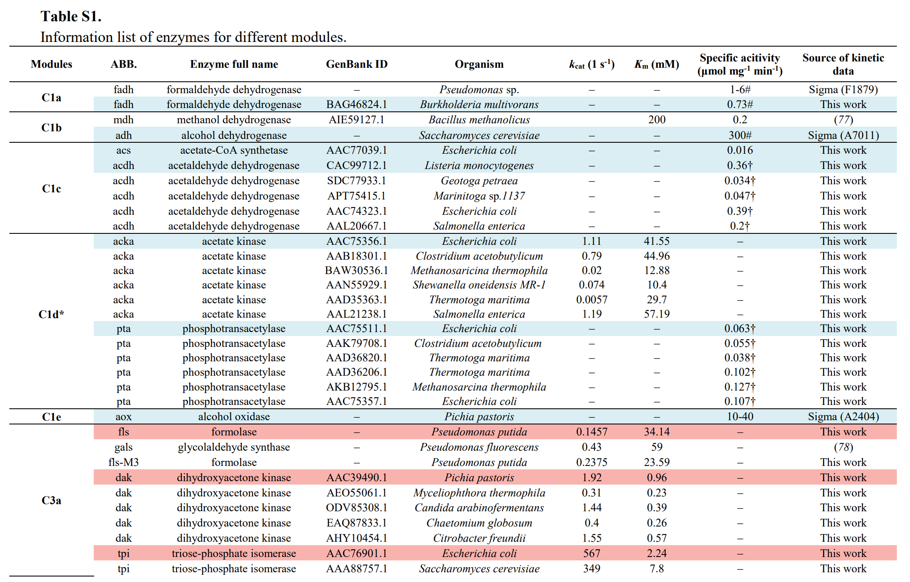

# outline

enzymes

> Enhanced crystalline cellulose degradation by a novel metagenome-derived cellulase enzyme

Celcm05-2: The camel rumen metagenome-assembled sequences and the predicted protein-coding genes have been deposited to the Integrated Microbial Genomes (IMG) database under the IMG dataset ID: 3300003523. [link](https://img.jgi.doe.gov/cgi-bin/m/main.cgi?section=GenomeSearchList&page=displayTaxonList&searchFilter=t.taxon_oid&searchTerm=3300003523&file=t.taxon_oid482636)
- a broader pH range

    
slides

>  Cell-free chemoenzymatic starch synthesis from carbon dioxide

##### Modules:
- C1 module (for formaldehyde production), 
- C3 module (for D-glyceraldehyde 3-phosphate production), 
- C6 module (for D-glucose-6-phospate production), 
- Cn module (for starch synthesis).

##### Enzymes selectioin:
- balance between conversion rate and enzyme yield.
- inhibition between enzymes.
- variants

